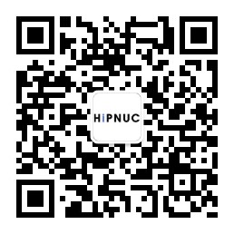

# 项目名称

简短地描述项目的主要功能和目的。

## 目录结构

- **usb_uart_drivers/**: USB转串口驱动程序。安装指南请参见 [驱动安装说明](usb_uart_drivers/README.md)。
- **examples/**: 各种平台和语言的示例程序及其源码，包括 STM32, ROS, Linux, MATLAB 等。

## 快速开始

1. **安装驱动：** 从 `usb_uart_drivers` 文件夹安装 USB转串口驱动程序。
2. **下载上位机软件：** 下载并安装 [CHCenter](http://download.hipnuc.com/internal/pc_host/CHCenter.7z)。
3. **硬件连接：** 将评估板的 USB 口连接到 PC，打开 CHCenter，连接到相应的 COM 口，开始产品评估。

## 示例代码

提供多种语言和平台的示例代码：

- [Python 示例](examples/Python)
- [C/STM32 示例](examples/STM32)
- [ROS (Melodic) 示例](examples/ROS_Melodic)
- [ROS2 示例](examples/ROS2)
- [Linux C 示例](examples/linux)
- [Linux 固件升级示例](examples/linux_ota)

## 资源

- 官方网站：[www.hipnuc.com](http://www.hipnuc.com)
- 产品资料和文档：[GitHub 仓库](https://github.com/hipnuc/products.git)

## 联系我们

欢迎通过以下方式关注我们和获取最新信息：

