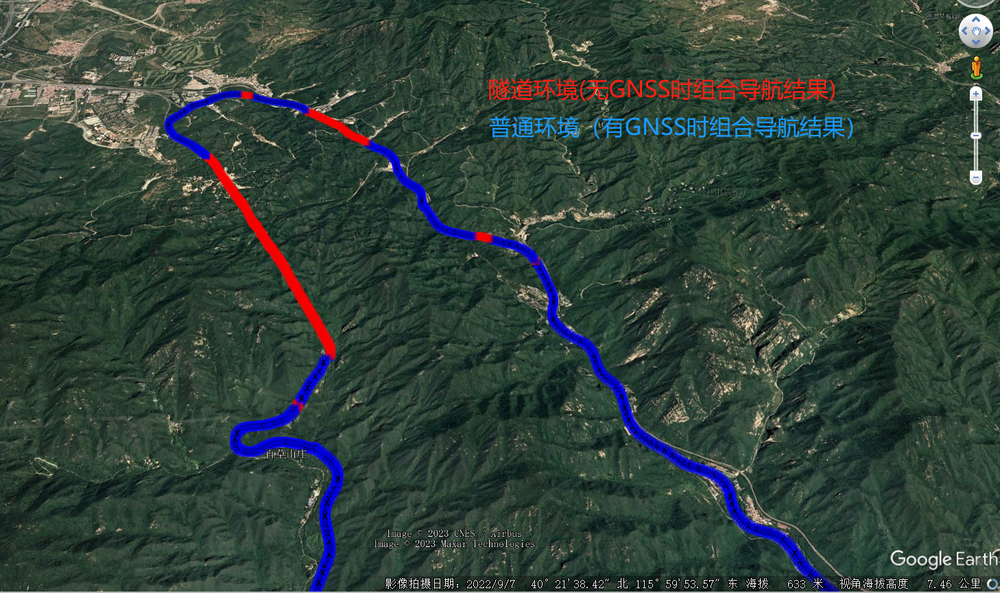

## 资料总览

本公司持续维护、更新产品与软件，为用户提供更良好的使用体验与功能。产品的用户手册请在官方网站资料下载页面中下载

| 文件夹  | 说明                        | 详细                                                         |
| ------- | --------------------------- | ------------------------------------------------------------ |
| example | C语言解析数据帧示例代码     |                                                              |
| sample  | CH310组合导航结果数据集样例 | DAT文件为NMEA GGA数据，kml文件为Google Earth轨迹，可直接用GoogleEarth打开。 |

更多内容请访问

> * 网站：www.hipnuc.com

欢迎关注超核电子:

