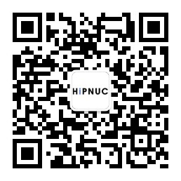

[English](README.md) | [中文](README_zh.md)

# HiPNUC SDKs and Examples

Libraries, tools and examples for reading, configuring and recording data from
HiPNUC IMU/AHRS/MRU and INS devices (firmware 1.6.9 or later).

## Choose your platform

| Directory | What it is |
| --- | --- |
| [python/](python/README.md) | Python SDK and `hipnuc` command line: find the device, read, record, send commands, Modbus RTU |
| [c/](c/README.md) | C/C++ integration, Windows/Linux serial API, protocol core and specialized tools |
| [ros/](ros/README.md) | ROS 2 Humble/Jazzy/Lyrical and ROS 1 Noetic drivers |
| [stm32/](stm32/README.md) | STM32F103 Keil examples for UART and J1939 reception |

Also available: [EtherCAT](ethercat/README.md),
[MATLAB](matlab/allan/README.md) and [CAN DBC files](protocol/dbc/README.md).

## Tools and documentation

- [Official downloads](https://download.hipnuc.com): CHCenter, product manuals and datasheets.
- [HiPNUC](https://www.hipnuc.com): products and contact information.
- Evaluation-board USB drivers: use the [current CP210x driver](https://www.silabs.com/developer-tools/usb-to-uart-bridge-vcp-drivers) if your OS needs one. Common Linux distributions include it; serial access may require the `dialout` group.

## Contact

