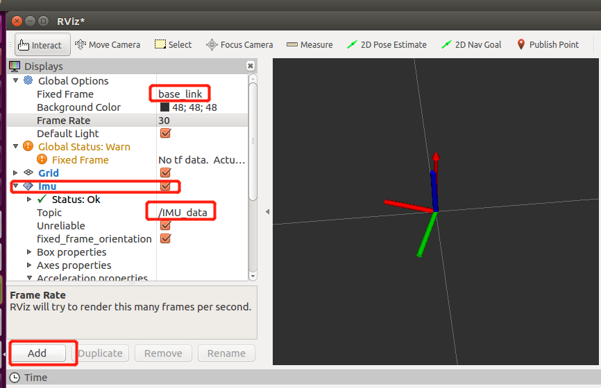

# ROS1串口例程

​	本文档介绍如何在ROS下来读取超核惯导产品的数据，并提供了c++语言例程代码，通过执行ROS命令，运行相应的节点，就可以看到打印到终端上的信息。

* 测试环境：Ubuntu18.04   

* ROS版本：ROS Melodic Morenia

* 测试设备：HI13系列 HI14系列 CH10x系列

## 安装USB-UART驱动

​	Ubuntu 系统自带CP210x的驱动，默认不需要安装串口驱动。将调试版连接到电脑上时，会自动识别设备。识别成功后，会在dev目录下出现一个对应的设备:ttyUSBx

检查USB-UART设备是否被Ubuntu识别：

1. 打开终端，输入`ls /dev`,先查看已经存在的串口设备。
2. 查看是否已经存在  ttyUSBx 这个设备文件，便于确认对应的端口号。x表示USB设备号，由于Ubuntu USB设备号为从零开始依次累加，所以多个设备每次开机后设备号是不固定的，需要确定设备的设备号。
4. 接下来插入USB线，连接调试板，然后再次执行`ls /dev`。 dev目录下多了一个设备`ttyUSB0`：

```shell
linux@ubuntu:~$ ls /dev
.....
hpet             net           tty11     tty4   ttyS0      ttyUSB0    vhost-vsock
hugepages        null          tty12     tty40  ttyS1      udmabuf  vmci
......
```

​	4.打开USB设备的可执行权限：

```shell
   $ sudo chmod 777 /dev/ttyUSB0
```

##  编译serial_imu_ws工作空间

1. 打开终端进入serial_imu_ws 目录
2. 执行`catkin_make`命令，编译成功后出现完成度100%的信息。
3. 如果是其他的ROS1系统，只需要把`serial_imu_ws/src/`下的`hipnuc_imu`文件夹移动到其他ROS1的工作空间下，直接编译就可以了。

##  修改串口波特率和设备号

1. 在Ubuntu环境中，支持的波特率为115200, 460800, 921600。本例程使用的默认波特率是115200，默认打开的串口名称是/dev/ttyUSB0。	

2. 如果您需要更高的输出频率，请编辑`hipnuc_imu/config/hipnuc_config.yaml`文件，修改如下两个参数：

   imu_serial:IMU对应的设备文件名称

   baud_rate:IMU的波特率

```c
#hipnuc config
imu_serial: "/dev/ttyUSB0"
baud_rate: 115200
frame_id: "base_link"
imu_topic: "/IMU_data"

#hipnuc data package ---> 0x91 
frame_id_costom: "base_0x91_link"
imu_topic_costom: "/imu_0x91_package"
```

修改完之后，保存，使新配置生效。

## 显示数据
本例程提供了两种查看数据方式：

1. 打印ROS标准imu.msg 数据
2. rviz工具实现可视化

### 	输出ROS标准 Imu.msg

​	1.打开一个终端，执行：

```shell
linux@ubuntu:~$ roslaunch hipnuc_imu imu_msg.launch
```

​	2.如果执行失败，提示找不到相应的launch文件，则需要配置环境，在当前终端执行：

```shell
linux@ubuntu:~$source <serial_imu_ws_dir>/devel/setup.bash
```

​	3.执行成功后，就可以看到所有的信息：

```txt
header: 
  seq: 595
  stamp: 
    secs: 1595829903
    nsecs: 680423746
  frame_id: "base_link"
orientation: 
  x: 0.0663746222854
  y: -0.611194491386
  z: -0.17232863605
  w: 0.769635260105
orientation_covariance: [0.0, 0.0, 0.0, 0.0, 0.0, 0.0, 0.0, 0.0, 0.0]
angular_velocity: 
  x: 0.0851199477911
  y: 0.0470183677971
  z: 0.00235567195341
angular_velocity_covariance: [0.0, 0.0, 0.0, 0.0, 0.0, 0.0, 0.0, 0.0, 0.0]
linear_acceleration: 
  x: 0.93323135376
  y: 0.317857563496
  z: 0.247811317444
linear_acceleration_covariance: [0.0, 0.0, 0.0, 0.0, 0.0, 0.0, 0.0, 0.0, 0.0]

```

### rviz可视化

​	1、打开终端，执行:

```shell
linux@ubuntu:~$roslaunch hipnuc_imu imu_rviz.launch
```

​	2、先点击左下角的`Add`标签，然后在弹出窗口中，选择 `By display type`标签，查找`rviz_imu_plugin`；找到之后，选择它下面的`imu`标签，点击OK, 这时，我们可以看到rviz的左侧的展示窗口中已经成功添加上了Imu的标签。在`FixedFrame`中填入**base_link** 。`topic`中添加 **/IMU_data**。这时，可以看到坐标系随传感器改变而改变。



