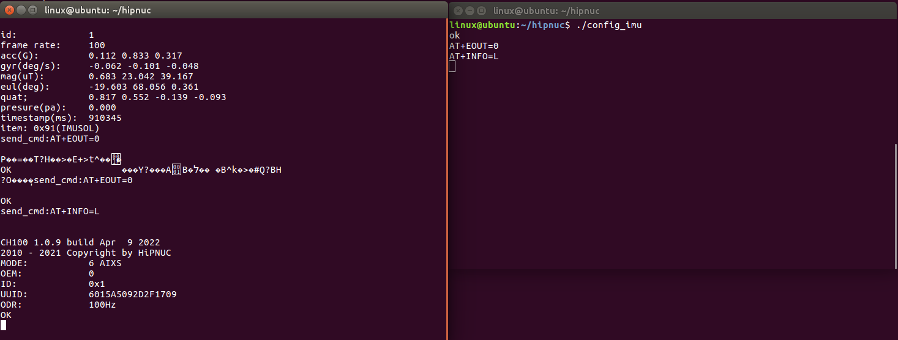
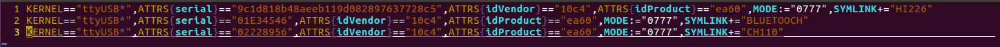

# 	Linux例程

本文档介绍了如何在Linux环境中读取本公司IMU产品的数据，本路径提供了c语言例程代码，生成的可执行文件用于读取模块的数据。

	* 测试环境： Ubuntu 18.04 / 树莓派4B
	* 测试设备：超核调试版 	HI226\HI229\CH100\CH110\CH0X0\CH10X\HI13\HI14\HI50

## 查找USB-UART设备

把IMU模块接入到linux的硬件接口上，这里以USB口为例进行说明，

输入 `ls /dev/tty*`

```
yandld@ubuntu:~/Desktop/products/examples/linux$ ls /dev/tty*
/dev/tty    /dev/tty21  /dev/tty35  /dev/tty49  /dev/tty62      /dev/ttyS17  /dev/ttyS30
...
/dev/tty15  /dev/tty29  /dev/tty42  /dev/tty56  /dev/ttyS10     /dev/ttyS24  /dev/ttyUSB0

```

如果是USB串口，一般为ttyUSB0, ttyUSB1 等。

## 下载例程代码

首先，通过如下代码下载例程代码：

```shell
yandld@ubuntu:~$ git clone https://github.com/hipnuc/products.git
Cloning into 'products'...   #(这个提示，从git上拉下来的文件夹名称为：products)
remote: Enumerating objects: 5018, done.
remote: Counting objects: 100% (1618/1618), done.
remote: Compressing objects: 100% (856/856), done.
remote: Total 5018 (delta 749), reused 1546 (delta 689), pack-reused 3400
Receiving objects: 100% (5018/5018), 522.17 MiB | 4.79 MiB/s, done.
Resolving deltas: 100% (2549/2549), done. 
```

如上内容提示，下载成功后，会在当前的 `home` 目录下，生成 `products` 文件夹，接下进入到这个文件夹，找到`linux` 文件夹：

```shell
yandld@ubuntu:~$ ls                            #（执行ls，查看是否存在products这个文件夹）
 Documents     Pictures    Videos    Downloads     products     Music     Public     snap
 Desktop    Templates
yandld@ubuntu:~$ cd products/                  #（进入到products文件夹）
yandld@ubuntu:~/products$ ls    
examples  img  README.md  usb_uart_drivers
yandld@ubuntu:~/products$ cd examples/         #（进入到example文件夹）
yandld@ubuntu:~/products/examples$ ls
CAN  linux  matlab  Python  ROS2  ROS_Melodic  RS485_Modbus  STM32
yandld@ubuntu:~/products/examples$ cd linux    #（进入到linux文件夹）
yandld@ubuntu:~/products/examples/linux$ ls
ch_serial.c  ch_serial.h  config_imu.c  img  main.c  Makefile  README.md
yandld@ubuntu:~/products/examples/linux$ 
```

到这一步，已经进入到 `linux` 目录下，接下来，就是编译当前目录下的文件。

## 编译执行示例代码

在当前目录下执行`make`, 生成可执行文件`main` 和 `config_imu`。 

```shell
yandld@ubuntu:~/products/examples/linux$ make
gcc -c -o ch_serial.o ch_serial.c
gcc -c -o main.o main.c
gcc -o main ch_serial.o main.o -lpthread
gcc -c -o config_imu.o config_imu.c
config_imu.c: In function ‘main’:
config_imu.c:57:4: warning: implicit declaration of function ‘exit’ [-Wimplicit-function-declaration]
    exit(0);
    ^~~~
config_imu.c:57:4: warning: incompatible implicit declaration of built-in function ‘exit’
config_imu.c:57:4: note: include ‘<stdlib.h>’ or provide a declaration of ‘exit’
gcc -o config_imu config_imu.o
yandld@ubuntu:~/products/examples/linux$ ls
ch_serial.c  ch_serial.o  config_imu.c  img   main.c  Makefile
ch_serial.h  config_imu   config_imu.o  main  main.o  README.md
yandld@ubuntu:~/products/examples/linux$ 
```

接下来，在当前目录下执行`sudo ./main ttyUSB0 115200`。其中ttyUSB0为设备名，需根据具体上一步填入正确设备名

```
id:             1
frame rate:     100
acc(G):         0.125 0.840 0.306
gyr(deg/s):     -0.471 -0.186 0.029
mag(uT):        -0.767 24.183 39.417
eul(deg):       -21.661 67.983 0.018
quat;           0.814 0.549 -0.156 -0.105
presure(pa):    0.000
timestamp(ms):  8452
item: 0x91(IMUSOL)
#（这个界面不要关，要常开，后面和模块交互需要用到这个终端界面）
```

## 命令行配置模块

​	按下 __ctrl + alt + t__ 打开命令行窗口，执行如下命令，进行配置模块：

```
yandld@ubuntu:~$ cd products/examples/linux
yandld@ubuntu:~/products/examples/linux$ ./config_imu  #（执行该文件，可以和模块进行交互）
ok          #（显示ok后，说明该文件执行成功，接下来可以输入AT指令和模块进行交互了）
AT+EOUT=0   #（在进行交互之前，请输入一次这个指令，停止数据输出）
....        #（接下来可以根据手册，输入想要执行的AT指令）
quit        #（配置完成后，输入quit，退出配置文件）
yandld@ubuntu:~/products/examples/linux$ 
```

示例：

```
#配置文件终端
yandld@ubuntu::~$ cd products/examples/linux
yandld@ubuntu:~/products/examples/linux$  ./config_imu  
ok         
AT+EOUT=0       #（停止数据输出）
AT+INFO=L       #（查看模块信息）
AT+ID=2         #（修改模块的ID号）
AT+BAUD=460800  #（修改模块的波特率）
AT+ODR=400      #（修改模块的数据输出频率）
AT+RST          #（配置完成后，输入这个指令，模块复位，使配置生效）
quit            #（退出配置文件）
yandld@ubuntu:~/products/examples/linux$
```


```shell
#信息显示终端
id:             1
frame rate:     100
acc(G):         0.125 0.835 0.315
gyr(deg/s):     0.016 0.042 0.018
mag(uT):        -0.017 25.667 39.725
eul(deg):       -21.614 67.933 1.301
quat;           0.816 0.551 -0.149 -0.096
presure(pa):    0.000
timestamp(ms):  2632091
item: 0x91(IMUSOL)
send_cmd:AT+EOUT=0      

Z�L����)(P��=�sU?H��>�|=�*=�dE=gff����AB�����݇B��?��P?��
                                                            ?i��ýOK
	#（在配置文件执行成功的时候，会自动发送一次AT+EOUT=0,但是有时候因为链路问题，导致模块没有成功接收到这个指令，会在这个界面输出乱码，这个时候只要在配置终端上，再一次输入AT+EOUT=0,按下回车就可以了）
send_cmd:AT+EOUT=0                   #（配置终端再一次发送AT+EOUT=0)

OK                                   #（模块返回ok）
send_cmd:AT+INFO=L                   #（配置终端发送AT+INFO=L）

CH100 1.0.9 build Apr  9 2022        #（模块返回的信息）
2010 - 2021 Copyright by HiPNUC
MODE:           6 AIXS
OEM:            0
ID:             0x1
UUID:           6015A5092D2F1709
ODR:            100Hz
OK
send_cmd:AT+ID=2                     #（配置终端发送AT+ID=2)

OK                                   #（模块返回ok）
send_cmd:AT+BAUD=460800              #（配置终端发送AT+BAUD=460800) 

BAUD=460800                          #（模块返回修改后的波特率）
OK                                   #（模块返回ok）
send_cmd:AT+ODR=400                  #（配置终端发送AT+ODR=400)

OK                                   #（模块返回ok）
send_cmd:AT+RST                      #（配置终端发送AT+RST)
0

OK
OK
��xx���xx���x�xxx���x������xx��x��x����xxxxx��x�xx��x�x��xxxxxx��x�����x�x���xx������x��x��xx��x���x��x��x���xxxx���xx�x���x��x�������x��x����xxx���x�xx�����xxx�����x���xx���xx���x�x��x�x���x�x�����x���x�x�x���xx����x�xx��x��x����x
............#（持续打印乱码中）
#（发送AT+RST指令之后，这个界面会打印乱码，这是因为程序处于配置模式，无法解析数据帧，只要在配置终端输入quit，退出配置模式，然后重新在该界面执行 
#sudo ./main ttyUSB0 <NEW BAUD>
#执行成功后，可以看到正常的imu姿态数据）

id:             2                              
frame rate:     400
acc(G):         0.112 0.804 0.328
gyr(deg/s):     -0.212 -0.111 0.029
mag(uT):        1.850 24.850 38.808
eul(deg):       -18.893 67.049 -0.261
quat;           0.822 0.544 -0.138 -0.093
presure(pa):    0.000
timestamp(ms):  83590
item: 0x91(IMUSOL)
#（重新连接之后，可以看到，之前的配置生效了）
```

截图



## (可选)绑定USB端口

有时候主板上需要插好多的usb设备，为了方便开发，通常会编写一个usb端口约束文件。如果是不同型号的usb设备，可以通过设备的id号来区分。如果是同型号的设备，他们的id号都是一样的，这个时候就需要更多的细分信息来区分不同的usb设备。接下来就操作一下如何区分同型号的usb设备。

```
linux@ubuntu:~$ lsusb
Bus 001 Device 001: ID 1d6b:0002 Linux Foundation 2.0 root hub
Bus 002 Device 012: ID 10c4:ea60 Cygnal Integrated Products, Inc. CP210x UART Bridge / myAVR mySmartUSB light
Bus 002 Device 011: ID 10c4:ea60 Cygnal Integrated Products, Inc. CP210x UART Bridge / myAVR mySmartUSB light
Bus 002 Device 010: ID 10c4:ea60 Cygnal Integrated Products, Inc. CP210x UART Bridge / myAVR mySmartUSB light
Bus 002 Device 008: ID 0e0f:0008 VMware, Inc. 
Bus 002 Device 003: ID 0e0f:0002 VMware, Inc. Virtual USB Hub
Bus 002 Device 002: ID 0e0f:0003 VMware, Inc. Virtual Mouse
Bus 002 Device 001: ID 1d6b:0001 Linux Foundation 1.1 root hub
linux@ubuntu:~$ 
```

观察上面的内容，发现有三个usb设备的id号完全一样，使用简单的id号区分行不通了，需要更多的设备信息。

```
linux@ubuntu:~$ ls /dev
agpgart          loop3               shm       tty32  tty63      ttyS7
autofs           loop4               snapshot  tty33  tty7       ttyS8
block            loop5               snd       tty34  tty8       ttyS9
bsg              loop6               sr0       tty35  tty9       ttyUSB0
btrfs-control    loop7               stderr    tty36  ttyprintk  ttyUSB1
bus              loop-control        stdin     tty37  ttyS0      ttyUSB2
......(未全部放出)
```

到这一步，dev文件中产生三个usb设备文件，分别是：ttyUSB0，ttyUSB1，ttyUSB2。

现在先看ttyUSB0的详细信息：

```shell
linux@ubuntu:~$ udevadm info --attribute-walk --name=/dev/ttyUSB0
#通过这个命令可以查看指定端口的详细信息
......
    ATTRS{devpath}=="2.2"
    ATTRS{idProduct}=="ea60"
    ATTRS{idVendor}=="10c4"
    ATTRS{ltm_capable}=="no"
    ATTRS{manufacturer}=="Silicon Labs"
    ATTRS{maxchild}=="0"
    ATTRS{product}=="CP2104 USB to UART Bridge Controller"
    ATTRS{quirks}=="0x0"
    ATTRS{removable}=="unknown"
    ATTRS{serial}=="01E34546"
......(信息太多了，就不全部放出来了，大家可以自己去看看详细的信息,这里只放出本次需要关心的信息)
```

然后是ttyUSB1的详细信息：

```shell
linux@ubuntu:~$ udevadm info --attribute-walk --name=/dev/ttyUSB1
#通过这个命令可以查看指定端口的详细信息
......
    ATTRS{devpath}=="2.3"
    ATTRS{idProduct}=="ea60"
    ATTRS{idVendor}=="10c4"
    ATTRS{ltm_capable}=="no"
    ATTRS{manufacturer}=="Silicon Labs"
    ATTRS{maxchild}=="0"
    ATTRS{product}=="CP2102N USB to UART Bridge Controller"
    ATTRS{quirks}=="0x0"
    ATTRS{removable}=="unknown"
    ATTRS{serial}=="9c1d818b48aeeb119d082897637728c5"
......(信息太多了，就不全部放出来了，大家可以自己去看看详细的信息,这里只放出本次需要关心的信息)

```

最后是ttyUSB2的详细信息：

```shell
linux@ubuntu:~$ udevadm info --attribute-walk --name=/dev/ttyUSB2
#通过这个命令可以查看指定端口的详细信息
......
    ATTRS{devnum}=="27"
    ATTRS{devpath}=="2.4"
    ATTRS{idProduct}=="ea60"
    ATTRS{idVendor}=="10c4"
    ATTRS{ltm_capable}=="no"
    ATTRS{manufacturer}=="Silicon Labs"
    ATTRS{maxchild}=="0"
    ATTRS{product}=="CP2104 USB to UART Bridge Controller"
    ATTRS{quirks}=="0x0"
    ATTRS{removable}=="unknown"
    ATTRS{serial}=="02228956"
......(信息太多了，就不全部放出来了，大家可以自己去看看详细的信息,这里只放出本次需要关心的信息)
```

​	通过上边的三个串口设备的信息，发现ATTRS{serial}=="xxxx"这一项，看起来特别随意。实际上这个是硬件的id号，也是硬件的唯一id号，通过这个号，给它起一个别名，这样一来，只要这个硬件id号被识别到，dev下就会出现自定义的端口名称设备文件，实现永久绑定端口号。

```shell
linux@ubuntu:~$ cd /etc/udev/rule.d/
linux@ubuntu:/etc/udev/rules.d$ ls
70-snap.core.rules  70-ttyusb.rules  99-vmware-scsi-udev.rules
#这一步是看看都有哪些约束文件，避免文件名重复
linux@ubuntu：~$ sudo vi defined_serial.rules
#这一步自定义一个串口约束文件名称，后缀为'.rules'
```

然后在这个文件中输入如下内容：



格式如下：

```shell
KERNEL=="ttyUSB*", ATTRS{serial}=="xxx", ATTRS{idVendor}=="xxx", ATTRS{idProduct}=="xxx", MODE:="0777（端口的权限）",SYMLINK+="(自定义名称)"
```

把对应的信息填对，最后保存并退出文件，执行：

```shell
linux@ubuntu:~$ service udev reload
root privileges required
linux@ubuntu:~$ service udev restart
linux@ubuntu:~$ ls /dev
agpgart          loop1               sg1       tty32  tty7       ttyS9
autofs           loop2               shm       tty33  tty8       ttyUSB0
block            loop3               snapshot  tty34  tty9       ttyUSB1
BLUETOOCH        loop4               snd       tty35  ttyprintk  ttyUSB2
....
CH110            mcelog              tty0      tty40  ttyS13     vcs1
....
HI226            rfkill              tty22     tty54  ttyS27     vfio
....
```

现在可以看到，自定义的usb端口名称已经出来了，在操作的时候，直接操作对应的设备文件就好了，不用去理会端口的编号是多少了。